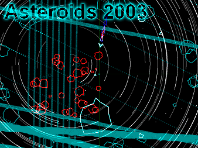



## A 2D Asteroids Game

### Description

Smooth animation, excellent wire frame graphics, No BitBlt, DirectX or OpenGL. Pure VB.

You probably won't believe what a nice game you can make with VB. Very smooth vector-style graphics with unique pan &amp; zoom functionality.

This game is not finished, but you can still have fun. It's certainly not your average Asteroids game.
 
### More Info
 

             |
---                |---
**Submitted On**   |2003-07-17 02:51:48
**By**             |[Peter Wilson](https://github.com/Planet-Source-Code/PSCIndex/blob/master/ByAuthor/peter-wilson.md)
**Level**          |Intermediate
**User Rating**    |4.4 (40 globes from 9 users)
**Compatibility**  |VB 6\.0
**Category**       |[Games](https://github.com/Planet-Source-Code/PSCIndex/blob/master/ByCategory/games__1-38.md)
**World**          |[Visual Basic](https://github.com/Planet-Source-Code/PSCIndex/blob/master/ByWorld/visual-basic.md)
**Archive File**   |[Asteroids\_1615857162003\.zip](https://github.com/Planet-Source-Code/peter-wilson-a-2d-asteroids-game__1-46958/archive/master.zip)

